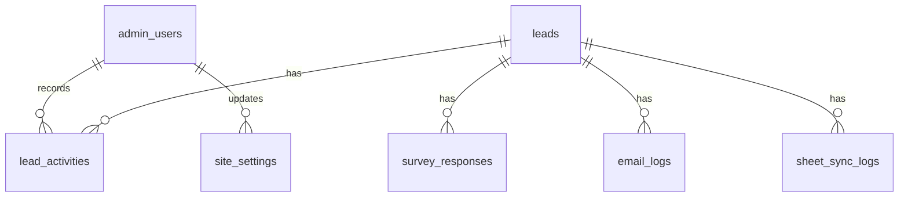

# Data Model

Supabase is the V1 source of truth. Google Sheets is only a future readable mirror/export and must not be treated as the primary database.

Actual schema foundation is in:

- `supabase/migrations/202606120001_v1_recruitment_foundation.sql`
- `src/integrations/supabase/types.ts`

The project previously had no migrations and no local tables in the generated Supabase type map.

## Tables

## admin_users

Simple Supabase Auth profile table for admin authorization.

| Column | Type | Notes |
| --- | --- | --- |
| id | uuid primary key | Same id as Supabase Auth user. |
| created_at | timestamptz | Default `now()`. |
| email | text | Unique. |
| display_name | text | Optional. |
| role | text | `owner`, `operator`, `readonly`. |
| is_active | boolean | Disable access without deleting history. |
| last_login_at | timestamptz | Optional. |

## leads

One row per recruitment lead.

| Column | Type | Notes |
| --- | --- | --- |
| id | uuid primary key | Default `gen_random_uuid()`. |
| created_at | timestamptz | Default `now()`. |
| updated_at | timestamptz | Maintained by trigger. |
| first_name | text | Required. |
| last_name | text | Optional. |
| email | text | Required, normalized by server utility. |
| phone | text | Optional. |
| suburb | text | Optional. |
| postcode | text | Optional. |
| age_range | text | Optional. |
| interest_type | text | Optional. |
| joining_timeline | text | Optional. |
| preferred_contact_method | text | Optional. |
| source | text | Optional source label. |
| utm_source | text | Optional UTM source. |
| utm_medium | text | Optional UTM medium. |
| utm_campaign | text | Optional UTM campaign. |
| consent_email | boolean | Default `true`. |
| consent_sms | boolean | Default `false`. |
| package_sent_at | timestamptz | Last package send timestamp. |
| package_clicked_at | timestamptz | Package click timestamp. |
| status | text | Controlled V1 status. |
| priority | text | `High`, `Medium`, `Low`. |
| next_follow_up_at | timestamptz | Drives Follow-Up Queue. |
| last_contacted_at | timestamptz | Last operator contact. |
| notes | text | Simple current notes field; detailed timeline lives in `lead_activities`. |
| sheet_synced_at | timestamptz | Future Sheets sync timestamp. |
| sheet_sync_status | text | `not_synced`, `pending`, `success`, `failed`. |

V1 statuses:

- `New`
- `Package Sent`
- `Needs Follow-Up`
- `Contacted`
- `Warm Lead`
- `Referred to Official Process`
- `Applied`
- `Joined`
- `Not Interested`
- `Bad Lead`

## survey_responses

Stores survey answers without forcing each question into a lead column.

| Column | Type | Notes |
| --- | --- | --- |
| id | uuid primary key | Default `gen_random_uuid()`. |
| lead_id | uuid | References `leads.id`, cascade delete. |
| created_at | timestamptz | Default `now()`. |
| question_key | text | Stable key. |
| question_label | text | Human-readable label at submission time. |
| answer | text | Answer text. |

## email_logs

Records package and follow-up email attempts.

| Column | Type | Notes |
| --- | --- | --- |
| id | uuid primary key | Default `gen_random_uuid()`. |
| lead_id | uuid | References `leads.id`, set null on delete. |
| created_at | timestamptz | Default `now()`. |
| email_type | text | Example: `how_to_join_package`. |
| recipient | text | Recipient email address. |
| subject | text | Email subject. |
| status | text | `queued`, `sent`, `failed`, `opened`, `clicked`, `bounced`, `complained`. |
| provider_message_id | text | Provider id. |
| error_message | text | Redacted failure reason. |
| sent_at | timestamptz | Send timestamp. |
| opened_at | timestamptz | Open timestamp if available. |
| clicked_at | timestamptz | Click timestamp if available. |

## lead_activities

Append-only activity timeline foundation.

| Column | Type | Notes |
| --- | --- | --- |
| id | uuid primary key | Default `gen_random_uuid()`. |
| lead_id | uuid | References `leads.id`, cascade delete. |
| created_at | timestamptz | Default `now()`. |
| actor_user_id | uuid | References `admin_users.id`, null for system events. |
| activity_type | text | Controlled V1 activity type. |
| metadata | jsonb | Structured event details. |

Activity types:

- `lead_created`
- `package_sent`
- `package_send_failed`
- `package_clicked`
- `email_followup_opened`
- `phone_call_clicked`
- `sms_clicked`
- `status_changed`
- `note_added`
- `followup_date_set`
- `package_resent`
- `sheet_sync_success`
- `sheet_sync_failed`

## site_settings

Safe operator-editable settings.

| Column | Type | Notes |
| --- | --- | --- |
| id | uuid primary key | Default `gen_random_uuid()`. |
| key | text | Unique controlled setting key. |
| value | jsonb | Setting value. |
| updated_at | timestamptz | Default `now()`. |
| updated_by | uuid | References `admin_users.id`. |

Supported keys:

- `hero_headline`
- `hero_subheadline`
- `cta_text`
- `popup_enabled`
- `popup_delay_seconds`
- `popup_title`
- `popup_description`
- `package_url`
- `email_subject`
- `email_body`
- `success_message`
- `notification_email`

## sheet_sync_logs

Future Google Sheets mirror/export logs.

| Column | Type | Notes |
| --- | --- | --- |
| id | uuid primary key | Default `gen_random_uuid()`. |
| lead_id | uuid | References `leads.id`, set null on delete. |
| created_at | timestamptz | Default `now()`. |
| status | text | `success` or `failed`. |
| error_message | text | Redacted failure reason. |
| metadata | jsonb | Provider details, row counts, spreadsheet ids, etc. |

## RLS

RLS is enabled on all V1 tables.

Public browser users do not get direct read/write policies for lead data. Lead submission must go through server-side code using the service role or an explicitly designed server endpoint.

Authenticated admins can read lead data when active in `admin_users`. `owner` and `operator` can mutate operational records. `readonly` can read only. Site setting updates are owner-only.
